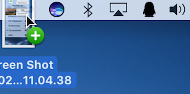
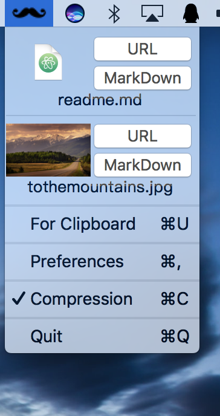

<h1 align="center">i7Niu For Mac</h1>

# Update
- 新增自动复制URL到剪切板
- fixed 文件上传后URL进行URLEncoding编码
- fixed 更新依赖的版本

# Install It
> [Download](https://github.com/hocgin/i7NiuForMac/releases)

1. OS X 10.12/Xcode 8.0/Swift 3.0
2. $ git clone --recursive https://github.com/hocgin/i7NiuForMac
3. $ pod install
4. open WeacherForMac.xcodeproj

# Has What ? :)
-  drag pictures  

- Status Bar   

# ISSUES
[New ISSUES](https://github.com/hocgin/i7NiuForMac/issues/new)

# Author

# Thanks
@runforever

# LICENSE
